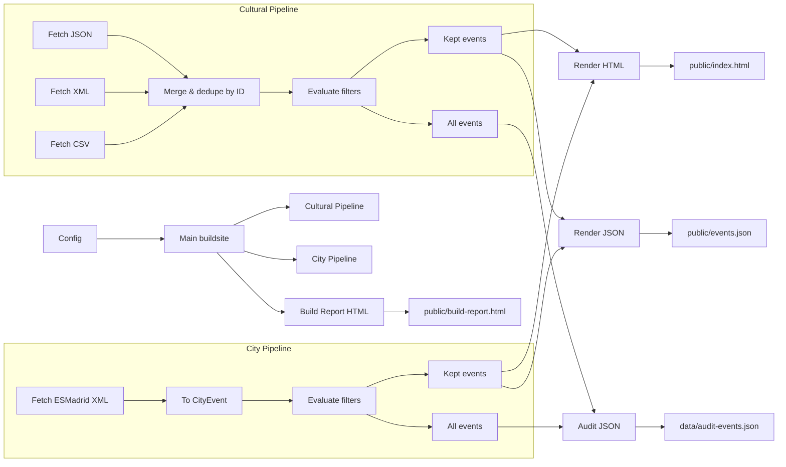
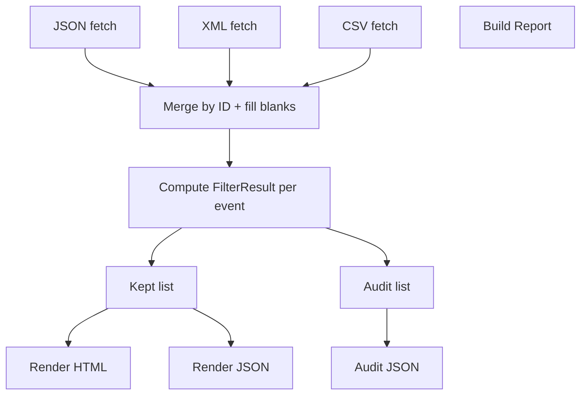
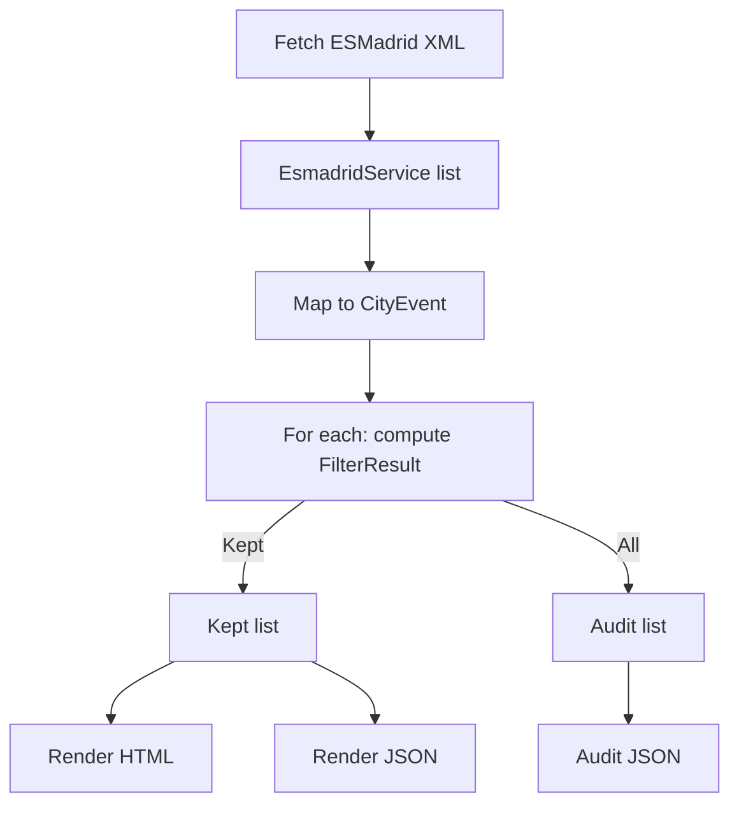
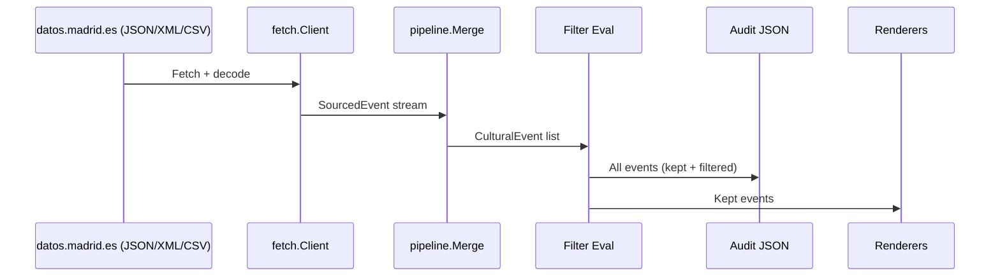

# Data Flow: Plaza España Calendar

This document explains how data flows through the codebase end-to-end, from external sources to final outputs, for both cultural and city events. It also clarifies what is audited, what is rendered, and where gaps or mismatches exist.

Updated: 2025-10-20

## High-level overview

- Two pipelines run in one build:
  - Cultural events (datos.madrid.es) — 3 parallel sources: JSON, XML, CSV
  - City/tourism events (esmadrid.com) — 1 XML source
- All successfully parsed events are enriched with filter decisions (FilterResult) for auditing.
- Only the events marked Kept=true are rendered to the HTML site and JSON API.
- Outputs:
  - HTML site: `public/index.html`
  - Machine JSON: `public/events.json`
  - Build report: `public/build-report.html`
  - Audit log: `data/audit-events.json`

### Overview diagram

## Cultural events pipeline (datos.madrid.es)

Code: `internal/pipeline/pipeline.go`, `internal/fetch/*` (JSON/XML/CSV), `cmd/buildsite/main.go`

- Fetching
  - `fetch.Client.FetchJSON(url)` parses `@graph` items to `event.CulturalEvent` (via `ToCanonical`).
  - `fetch.Client.FetchXML(url)` custom-unmarshals nested attributes to `XMLEvent -> CulturalEvent`.
  - `fetch.Client.FetchCSV(url)` reads Windows-1252 CSV; tries `;` then `,`; each row to `CSVEvent -> CulturalEvent`.
  - Each fetch returns `event.ParseResult{Events []SourcedEvent, Errors []ParseError}`; errors are per-record, non-fatal.
  - `Pipeline.FetchAll()` calls the three fetchers in isolation with panic recovery and collects results.

- Merge & deduplicate
  - `Pipeline.Merge(result)` merges all `SourcedEvent` by `Event.ID` into unique `event.CulturalEvent`.
  - When merging duplicates, it accumulates `Sources` and fills missing fields (Distrito, VenueName, Address, Description, Lat/Lon).

- Filtering (non-destructive; for audit)
  - For every merged event, the code computes `event.FilterResult`:
    - Distrito: matches allowed distritos from config.
    - Geo: Haversine distance versus config center within radius.
    - Text: keyword fallback when location data is missing.
    - Time: “too old” if start is older than N weeks from now.
  - Decision: sets `Kept` + `FilterReason` using a priority order (outside distrito -> outside GPS radius -> too old -> kept).
  - All events (kept and filtered) are retained in-memory for audit export.

- Rendering
  - Kept events are sorted by `StartTime` and rendered:
    - HTML: grouped in time ranges (ongoing/past weekend/now/this weekend/this week/later this month) using `render.GroupEventsByTime` and `templates/index-grouped.tmpl.html`.
    - JSON: a slim event shape (`render.JSONEvent`: id, title, start_time, venue_name, details_url).

### Cultural pipeline diagram

## City events pipeline (esmadrid.com)

Code: `internal/fetch/esmadrid.go`, `cmd/buildsite/main.go`

- Fetching & parsing
  - `fetch.FetchEsmadridEvents(url)` returns `[]EsmadridService` from XML.
  - `EsmadridService.ToCityEvent()` maps nested fields to `event.CityEvent` (title/name, venue, coords, category, date range, URLs).

- Filtering (non-destructive; for audit)
  - For every parsed city event, compute `FilterResult` with Geo + Time rules and decide `Kept`.
  - All events are retained for audit; only kept ones render.

- Rendering
  - Kept city events render into the same grouped HTML and JSON structures (with the city subset).

### City pipeline diagram

## Auditing and reporting

- Audit JSON (all events, kept + filtered):
  - File: `data/audit-events.json`
  - Built by: `audit.SaveAuditJSON(allCultural, allCity, path, buildTime, duration)`
  - Contains:
    - Build meta (time, duration, total events)
    - `CulturalEvents` AuditPipeline and `CityEvents` AuditPipeline:
      - Totals, kept vs filtered
      - FilterBreakdown by `FilterResult.FilterReason`
      - Raw JSON of each event including `FilterResult` snapshot

- Build Report HTML (process metadata):
  - File: `public/build-report.html`
  - Built by: `BuildReport.WriteHTML`
  - Shows:
    - Fetch attempts per source (status, event counts, durations)
    - Cultural merge/dedup stats and source-coverage
    - Filtering stats (geo/time/distrito) for both pipelines
    - Output file statuses

## Outputs and what data they contain

- `public/index.html`
  - Human-facing grouped listing.
  - Includes only kept events from both pipelines (transformed to `TemplateEvent`).

- `public/events.json`
  - Machine-readable slim list of kept events for both pipelines.
  - Minimal fields: id, title, start_time, venue_name, details_url.

- `public/build-report.html`
  - Build-time telemetry: fetching, merging, filtering, output status.
  - Summaries; not a per-event log.

- `data/audit-events.json`
  - Comprehensive per-event audit, including filtered-out events and reasons.
  - Intended to answer “was every event considered and why was it kept/filtered?”.

## Coverage checklist (concern: all events are processed and audited)

- Cultural pipeline
  - All successfully parsed events from JSON/XML/CSV are merged and evaluated.
  - Every merged event is included in audit with its `FilterResult`.
  - Events that failed to parse are NOT included in the audit (see Gaps below).

- City pipeline
  - All successfully parsed `EsmadridService` records that map to `CityEvent` are evaluated and audited.
  - Services that fail to convert to `CityEvent` are NOT included in the audit (see Gaps below).

- Rendering
  - Only `Kept=true` events from both pipelines are rendered to HTML and JSON.

- Reporting
  - Fetch failures and some counts are displayed in the build report, but not per-record error detail.

## Noted gaps and mismatches

These are actionable findings where data does not fully align with intent or metrics may be misleading.

1) Parse failures are not audited
- Where: `internal/fetch/client.go` returns `ParseResult.Errors`, but `audit.SaveAuditJSON` only receives successful events (`allEvents`, `allCityEvents`).
- Effect: Events that could not be parsed are invisible in the audit file (no IDs/reasons captured there).
- Suggestion: Extend `audit.AuditFile` to include a `ParseErrors` section per pipeline with `{source, index/id, error, recover_type}`; plumb through from `pipeResult.JSONErrors/XMLErrors/CSVErrors` and city parse errors.

2) Cultural filtering stats in Build Report mix categories
- Where: `cmd/buildsite/main.go` when constructing `report.GeoFilterStats` and `report.DistrictoFilterStats`.
- Issues:
  - `OutsideRadius` is set to `outsideAll`, which includes both “outside distrito” and “outside GPS radius”.
  - `MissingCoords` is set to `missingBoth` (no distrito and no coords), which is not the same as “missing coordinates”.
  - `Kept` uses `len(filteredEvents) + pastEvents`, double-counting in some contexts (kept should not include "too old").
- Effect: Build report percentages and counts can be misleading.
- Suggestion: Track independent counters per reason and populate stats fields with the corresponding counters only (e.g., separate `outsideDistrito`, `outsideRadius`, `missingCoords`, `tooOld`).

3) City pipeline assumes coordinates always present
- Where: City event filtering sets `result.HasCoordinates = true` unconditionally.
- Issues:
  - `EsmadridService.ToCityEvent()` sets lat/lon to 0.0 on parse failure; those events are treated as having coordinates and will almost surely be filtered out as “outside GPS radius” due to (0,0).
- Effect: False negatives; valid events with missing coords may be incorrectly dropped.
- Suggestion: Set `HasCoordinates` based on non-zero lat/lon, and either (a) allow text/distrito fallback for city events, or (b) treat missing coords separately with a distinct `FilterReason`.

4) Source coverage calculation may be inflated by duplicate source labels
- Where: `Pipeline.Merge` appends `sourced.Source` but does not dedupe the `Sources` slice post-merge.
- Effect: If the same ID appears multiple times within a single source, `len(evt.Sources)` may exceed 1 with duplicates (e.g., ["JSON", "JSON"]) which inflates coverage buckets (InTwoSources/InAllThree).
- Suggestion: Deduplicate `Sources` after merging (reuse `validate.SanitizeEvent` or local set).

5) Snapshot fallback not implemented when all sources fail
- Where: `cmd/buildsite/main.go` has `TODO: Implement snapshot loading` when JSON/XML/CSV all fail.
- Effect: In a total outage, the site renders nothing and audit/build report reflect 0 cultural events despite having prior snapshots available.
- Suggestion: Implement `snapMgr.LoadSnapshot()`, then convert `[]fetch.RawEvent` back to `[]event.CulturalEvent` for filtering/audit/render. Note audit file should mark that snapshot data was used.

6) Build report counts for city fetch vs parsed
- Where: City pipeline logs `parseErrors` but the `FetchAttempt.EventCount` uses number of services fetched, not number of `CityEvent`s parsed.
- Effect: Fetch attempt may appear successful with higher event counts than actually usable.
- Suggestion: Track both: fetched services and parsed city events; display both or switch to parsed count.

7) JSON output omits EndTime and some fields
- Where: `render.JSONEvent` supports `EndTime` but cultural/city serialization only sets `StartTime`.
- Effect: Consumers cannot see end times even when known.
- Suggestion: Populate `EndTime` when available.

## Configuration touchpoints

- `internal/config/config.go`
  - Cultural URLs: JSON, XML, CSV
  - City URL: XML
  - Filters: center lat/lon, radius km, distritos, past events window (weeks)
  - Outputs: HTML and JSON paths
  - Snapshot: data dir

## Data shapes (contracts)

- `event.CulturalEvent`
  - Core: ID, Title, Description, StartTime, EndTime
  - Location: Latitude, Longitude, VenueName, Address, Distrito
  - Metadata: DetailsURL, Sources[]
  - Audit: FilterResult

- `event.CityEvent`
  - Core: ID, Title, Description, StartDate, EndDate
  - Location: Venue, Address, Latitude, Longitude
  - Metadata: Category, Subcategory, WebURL, ImageURL, Price
  - Audit: FilterResult

- `event.FilterResult` (captured for ALL evaluated events)
  - Distrito flags, Geo distance/within-radius, TextMatched, Time fields, DaysOld, TooOld, Kept, FilterReason

## Success criteria and edge cases

- Success: All successfully parsed records are evaluated, audit captures every evaluated record with filter decisions, render includes only Kept.
- Edge cases to watch:
  - Empty/malformed upstream rows (ensure ParseError is recorded; consider auditing).
  - Missing IDs (CSV/XML) — dedupe relies on stable IDs.
  - Timezones (Europe/Madrid); CSV/XML vs JSON date formats.
  - Big feeds — keep per-record error handling non-fatal.
  - Zero coordinates — avoid misclassifying as outside radius.

## Next steps (low-risk improvements)

- Add parse-error sections to the audit file to guarantee full coverage, including failed rows/services.
- Correct Build Report counters to avoid mixing reasons and double-counting.
- Treat missing coordinates explicitly in both pipelines; for city events, do not assume coords are always present.
- Deduplicate `Sources` post-merge before computing coverage metrics.
- Implement snapshot load fallback for cultural events outage.
- Populate `EndTime` in JSON API where available.

