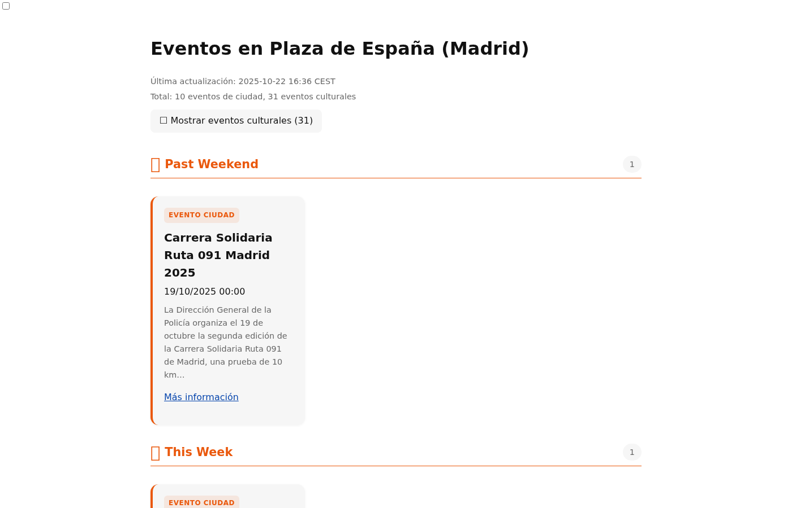
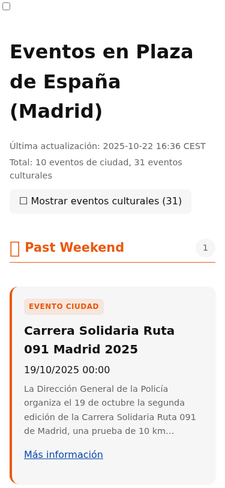
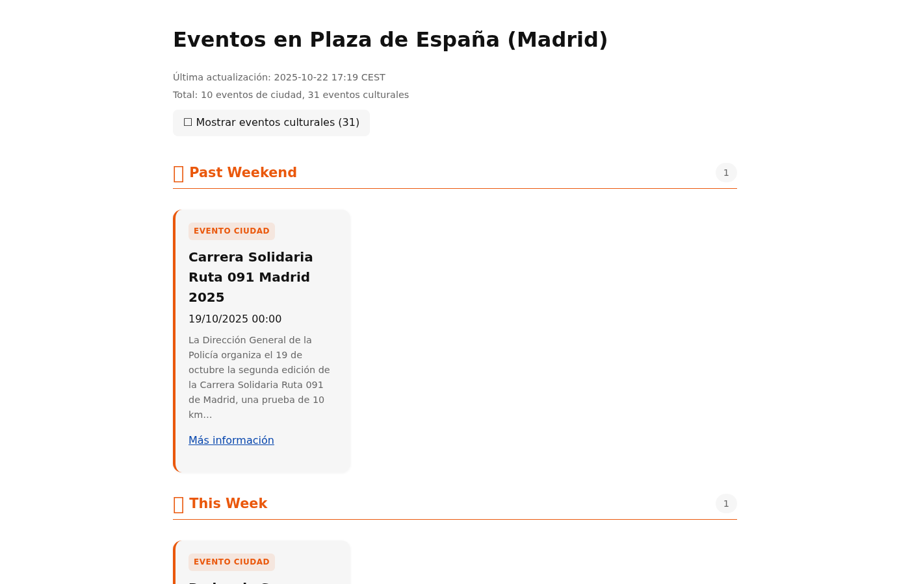
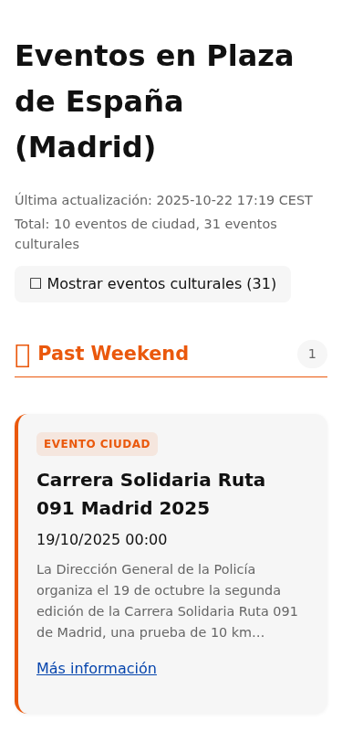

# Checkbox Bug Fix

**Date**: 2025-10-22
**Issue**: Checkbox appearing in top-right corner linked to "Mostrar eventos culturales" button
**Status**: ✅ Fixed

## Problem Description

A visible checkbox was appearing in the top-left corner of the page, separate from the styled "Mostrar eventos culturales (31)" toggle button. This created a confusing UX where users could see both:
1. A raw, unstyled checkbox in the top-left corner
2. The intended styled toggle button in the header

## Root Cause

The checkbox element (`#toggle-cultural`) in `/workspace/templates/index-grouped.tmpl.html` line 36 was being rendered without proper hiding styles. This checkbox serves as a state container for CSS-based toggling (using the `:checked` pseudo-class), but should not be visible to users.

The inline CSS on lines 30-32 only set `margin-right: 0.5rem` for the checkbox, which left it visible.

## Screenshots

### Before Fix

**Desktop view:**



- Visible stray checkbox in top-left corner
- Properly styled toggle button below it
- Section headers showing emoji boxes (calendar icons)

**Mobile view:**



- Same stray checkbox issue
- Consistent across all viewports

### After Fix

**Desktop view:**



- ✅ No stray checkbox
- Only the styled toggle button is visible
- Clean, professional appearance

**Mobile view:**



- ✅ No stray checkbox
- Toggle button renders correctly
- Consistent with desktop fix

## Solution

Changed the CSS rule for `#toggle-cultural` from:
```css
#toggle-cultural {
  margin-right: 0.5rem;
}
```

To:
```css
#toggle-cultural {
  display: none;
}
```

This hides the checkbox input element while preserving its functionality as a state container for the CSS `:checked` selector. Users interact with the styled `<label for="toggle-cultural">` element instead.

## Files Changed

- `/workspace/templates/index-grouped.tmpl.html` (line 30-32)

## Verification

1. Captured before screenshots showing the bug
2. Applied fix to hide checkbox with `display: none`
3. Rebuilt site with `just build` and ran `./build/buildsite`
4. Captured after screenshots confirming fix
5. Verified fix works across desktop, tablet, and mobile viewports

## Notes

The checkbox pattern used here is a common CSS technique for implementing pure-CSS toggles:
- An `<input type="checkbox">` element stores the toggle state
- A `<label>` element provides the styled, clickable UI
- CSS selectors like `#toggle-cultural:checked ~ main .cultural-section` control visibility based on checkbox state
- The checkbox itself must be hidden with `display: none` to avoid showing the raw input

This pattern requires no JavaScript and works with keyboard navigation (space to toggle when label is focused).
